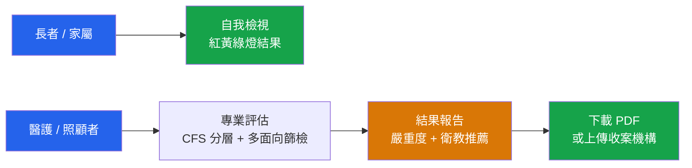

# 高齡周全性評估 CDS

> 一個免費、免登入、免安裝的線上高齡健康評估服務。
> 打開瀏覽器就能用，所有評估都在你自己的裝置上完成，保護隱私。

**線上使用：** <https://smart-geri-cds.yao.care/>

---

## 這是什麼

隨著年齡增長，健康問題往往不只一種——行動、記憶、情緒、營養、用藥、社會關係，常常彼此牽連。**高齡周全性評估（Comprehensive Geriatric Assessment, CGA）** 是國際公認的方法，用多個面向一起看一位長者的整體狀況，而不是只看單一疾病。

這個服務把專業的 CGA 流程，做成任何人都能在手機或電腦上使用的工具。它幫你：

- **看清整體**——一次涵蓋高齡照護的 20 個面向，而不是片段。
- **看懂結果**——用紅黃綠燈與白話說明呈現，告訴你哪裡需要留意、該找誰。
- **把結果帶著走**——可下載 PDF，帶去門診或長照據點，幫助你和專業人員溝通。

它**不是診斷工具**，而是一個篩檢與溝通的起點。

---

## 給誰用

這個服務有兩種使用方式，分別為不同的人設計。

### 🟢 民眾自我檢視

> 為長者本人或家屬設計，不需要任何醫療背景。

- 用**最白話的問題**了解自己或家人的健康狀況
- **大字體、可語音朗讀**，長輩也能輕鬆操作
- 結果用**紅黃綠燈**呈現，不打分數、不下診斷，只告訴你「目前還好」或「建議找專業人員看看」
- 若偵測到情緒上的危險訊號，會**立即提供求助專線**（1925 心理諮詢、1995 生命線）
- 可下載 **PDF**，帶去給醫師或照顧團隊

### 🔵 專業評估

> 為醫護人員、長照服務者、社區照護據點設計。

- 先用國際通用的**臨床衰弱量表（CFS 1–9）**定下基準
- 涵蓋**行動、認知、情緒、營養、共病、用藥、跌倒、失禁、感官、社會支持、照顧者負荷、預立醫療**等完整面向
- **聰明分層出題**：先做簡短篩檢，只有發現異常才深入評估，省下大量時間
- 支援**五次坐立攝影機計時**等功能性測驗
- 自動彙整每個面向的嚴重程度、產生圖表與報告
- 依評估結果與衰弱程度，**推薦對應的衛教文章與影片**
- 完成後可輸出標準化報告，或**上傳到合作的收案機構與醫院**接續照護

---

## 為什麼選這個服務

- **🔒 隱私優先**——所有評估都在你的裝置上完成，預設不上傳任何資料。只有當你主動選擇「上傳到收案機構」時，資料才會送出。
- **📴 可離線使用**——安裝為手機 App（PWA）後，沒有網路也能評估。
- **💯 完全免費、免登入**——不收費、不註冊、不留個資。
- **🏥 可與醫療系統介接**——採用國際 SMART on FHIR 標準，能把評估結果接到合作醫院或收案機構的系統。
- **📖 開源透明**——所有評估邏輯與內容公開，歡迎臨床專業者檢視與貢獻。

---

## 重要聲明

本服務為**健康篩檢與衛教溝通工具，非醫療診斷**。所有結果僅供參考，並協助你與醫療專業人員溝通，**不能取代醫師的專業診斷與治療建議**。如有健康疑慮，請諮詢合格的醫療人員。

---

## 給開發者

技術架構、開發指令、貢獻方式與設計規範，請見 [`CLAUDE.md`](./CLAUDE.md) 與 `docs/` 目錄。

本服務以 SMART on FHIR 標準運行於瀏覽器端、零後端、部署於 GitHub Pages。

## 授權

MIT License
