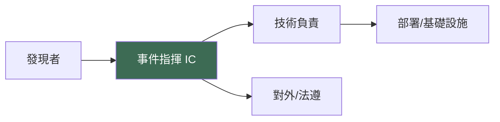

# 事件回應聯絡窗口（ISO 27001 A.5.26）

> ⚠️ 以下為**待填**清單。請填入真實聯絡人與備援聯絡人，並至少每半年複查一次。
> 公開 repo 中**避免放置個人手機/私人 email**；建議使用角色信箱或內部通訊渠道，
> 必要時將真實聯絡明細置於私有 ISMS 系統，本檔僅保留角色與指向。

## 主要窗口

| 角色 | 職責 | 主要聯絡人 | 備援聯絡人 | 聯絡方式 |
|---|---|---|---|---|
| 事件指揮（IC） | 統籌回應、分級決策 | （填寫） | （填寫） | （填寫：角色信箱/內部渠道） |
| 技術負責 | 遏制、修補、部署 | （填寫） | （填寫） | （填寫） |
| 部署/基礎設施 | GitHub Pages、DNS、密鑰輪替 | （填寫） | （填寫） | （填寫） |
| 對外/法遵 | 通知收案機構、法遵溝通 | （填寫） | （填寫） | （填寫） |

## 外部相關方

| 對象 | 用途 | 聯絡指向 |
|---|---|---|
| 網域註冊商 / DNS 服務商 | 網域或 DNS 劫持時還原 | （填寫） |
| 收案機構（FHIR 資料接收方） | 涉上傳資料風險時通知 | （填寫：依資料處理協議窗口） |
| GitHub 支援 | Pages/Actions 異常 | https://support.github.com/ |

## 通報路徑

> 複查記錄：上次複查（填寫 YYYY-MM-DD）／負責人（填寫）。
