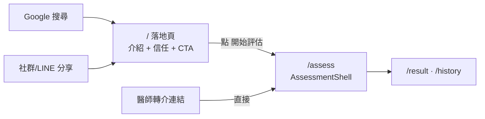

# 首頁引流落地頁 + 問卷審閱記錄修正 — 設計文件

- 日期：2026-05-25
- 狀態：待用戶審查
- 觸發：about 頁右側留白問題 →（用戶轉向）首頁缺引流入口 → 連帶發現問卷臨床審閱記錄異常

## 1. 背景與目標

### 問題
目前首頁 `/`（`src/pages/index.astro`）一進來就直接掛載 `AssessmentShell`，訪客看到的第一個畫面是「填寫孩子基本資料」的 profile 表單（或續做提示），**沒有任何介紹、價值主張、信任說明**。完整介紹反而藏在次要的 `/about/`。

### 目標
為「引流」服務：讓**冷／半冷流量的家長**（主要來自 Google 搜尋與家長社群／口碑分享，非醫院轉介）一進首頁就能在數秒內理解「這是什麼、安不安全、要多久、能得到什麼」，並順暢進入評估。

### 受眾（已確認）
對孩子發展有疑慮的家長，主力管道 = **SEO + 社群分享**（暖流量的醫師轉介為次要，但設計需相容）。

## 2. 範圍

### 本次涵蓋
1. 首頁 `/` 改為引流落地頁（landing）。
2. 評估流程搬遷至新路由 `/assess`。
3. 落地頁的信任段內容（誠實底線，見 §5）。
4. `questions.json` 資料修正（審閱記錄 + 重複 ID，見 §7）。
5. about 頁右側留白修正（兩欄版面 + 側欄，見 §4-1）。

### 不在本次（明確排除）
- 生命徵象規則／基線（`pediatric-default.yaml`、`pediatric-baselines.json`）的來源補登：**未經本次審閱確認**，維持原狀，不在範圍。
- 真插畫、i18n：依 2026-05-18 決議不做。
- 具名審閱者背書：用戶要求先不揭露。

## 3. 結構決策（已確認：方案 A）

**`/` = 純內容落地頁；評估搬到 `/assess`。**

理由：
- **SEO**：`/` 變成輕量、快速、可索引的靜態內容頁，不在首屏載入沉重的 `AssessmentShell`（`client:load`）island。
- **分享**：社群貼出連結點進來看到的是「介紹」而非冷表單，降低跳出率。
- **關注點分離**：`/` 管引流與信任、`/assess` 管評估流程，各自單一職責。
- **暖流量相容**：醫師轉介可直接發 `/assess` 連結繞過落地頁。

代價：想直接做評估的人多一次點擊（以第一屏 CTA 抵銷）。

## 4. 落地頁內容骨架

由上到下，每段一個目的（不灌水）：

1. **Hero**：H1 價值主張（含家長會搜的關鍵詞）＋ 副標（給誰、解決什麼）＋ 主 CTA「開始評估」（→ `/assess`）＋ 微信任條（免費・免登入・隱私・約 N 分鐘）。
2. **共鳴痛點**：「您是不是也擔心孩子說話比較慢、走路比較晚？」建立連結，同時是 SEO 長尾關鍵詞落點。
3. **怎麼運作（3 步驟）**：填基本資料 → 引導式評估 → 即時建議與分流。降低未知恐懼。
4. **你會得到什麼**：風險分級、衛教建議、是否需就醫的分流參考。
5. **為什麼可信（信任段）**：見 §5 誠實底線。
6. **常見問題 FAQ**：重用 `about.astro` 既有 3 題（含 FAQ JSON-LD schema）＋ 視需要增補。
7. **免責聲明**：非診斷、僅供分流參考、未經信效度驗證、急症或持續疑慮請就醫。
8. **最終 CTA**：捲到底再給一次「開始評估」。

> 文案最終稿在實作階段定；本段為結構與訊息骨架。

## 4-1. about 頁版面修正（一起做）

### 問題
`about.astro` 的 `.about-section p` 有 `max-width: 72ch`（刻意的易讀行寬）。其中「系統介紹」與「技術架構」兩段是單一寬段落，在寬螢幕上右側留下大片空白，與下方卡片格線段落（功能概覽、使用方式）視覺不一致。

### 決策（保留行寬，補右側內容）
72ch 行寬**維持不動**；改為「左文字 + 右側欄」的兩欄版面（寬螢幕並排，窄螢幕自動疊成單欄）：

1. **系統介紹** 右側 → **重點摘要卡**（at-a-glance）：雙角色（家長／醫護）、隱私優先、開源免費、SMART on FHIR。
2. **技術架構** 右側 → **技術棧 badge**：Astro 5、Svelte 5、Web Worker、GitHub Pages、零後端。
3. **頁面底部** → 加一個 CTA「開始評估」（→ `/assess`），把 about 訪客導回評估流程。

### 實作要點
- 用 CSS grid（如 `grid-template-columns: minmax(0, 72ch) minmax(0, 1fr)` 或 `1fr auto`），窄螢幕 `@media` 收成單欄。
- 側欄卡片沿用既有 `--surface` / `--line` / `--radius-*` token 與既有 `.feature-item` / `.usage-card` 視覺語彙，不另造風格。
- 重點摘要與 badge 內容須符合 §5 誠實底線（隱私／開源／架構等可查證事實，不寫量表背書）。
- 維持最小字級 18px、觸控目標 44px。

## 5. 信任段誠實底線（核心約束）

專案規則禁止過度承諾；這是醫療分流工具，信任段只能寫可查證或經確認的事實。

| 可以誠實寫 ✅ | 不能寫 ❌ |
|---|---|
| 開源、資料不離開瀏覽器、離線運算、不收集不轉傳（可查證事實） | — |
| 「六大發展面向與國健署『學前兒童發展檢核表』、ASQ-3 等通用篩檢工具**架構一致**」 | 「**採用**國健署檢核表／ASQ-3 標準化量表」 |
| 「題目**參考**一般兒童發展里程碑編寫」 | 「**經信效度驗證**」 |
| 「題目經**兒科專業人員審閱**（2026-05）」（用戶提供之事實） | 具名背書（用戶要求先不揭露） |
| 明確免責：非診斷、僅供參考、請諮詢專業 | — |

**量表比對依據**（2026-05-25 查證）：44 題的 6 大網域（粗動作／精細動作／語言理解／語言表達／認知／社會情緒）在領域架構上與國健署學前兒童發展檢核表、ASQ-3（5 領域）高度一致；題目皆為跨工具共通的通用里程碑。但題目為人工自編（`source: manual`），年齡分段、題幹、0/1/2 計分為自訂，未對應任何單一標準化量表的題目與常模，亦未做信效度驗證。故只能宣稱「架構一致／參考里程碑」，不能宣稱「採用標準化量表／經驗證」。

## 6. 路由與導覽變更

- 新增 `src/pages/assess.astro`（或 `src/pages/assess/index.astro`）：搬入原 `index.astro` 的 `AssessmentShell` 掛載（含 `cards` 取得邏輯、`client:load`）。續做未完成評估的邏輯在 shell 內，隨之遷移。
- `src/pages/index.astro` 改寫為落地頁（Astro 元件為主，零或極少 JS；CTA 為連結，不需 island）。
- `Header.astro`：site-title `<a href="/">` 維持指向落地頁；考慮在導覽列加一個明顯的「開始評估」CTA（→ `/assess`）。其餘 navLinks（評估紀錄／衛教資源／關於）不變。
- 落地頁所有「開始評估」CTA 一律連到 `/assess`。
- base path：沿用現有 bare 絕對路徑慣例（如 `/history/`），新路由用 `/assess/`。

## 7. 資料修正（`src/data/questionnaire/questions.json`）

依用戶確認：全部 44 題已獲專家審閱，審閱日期 2026-05-01，審閱者先不揭露。

1. `clinicallyReviewed`: `false → true`（全部 44 題）。效果：`QuestionnaireModule.svelte:190` 的「未審」徽章（`aria-label="本題尚未經臨床顧問審查"`）將不再顯示——此為預期行為。
2. 新增 `reviewedAt: "2026-05-01"`。
3. **不**寫入審閱者姓名（repo 公開；先不揭露）。
4. `source`：**維持 `manual`**（題目確為自編，誠實）；另加 `basis` 欄位記錄透明度資訊，例：`"basis": "通用發展里程碑；領域架構對齊國健署學前兒童發展檢核表 / ASQ-3"`。
5. **修正重複 ID**：`lc-05` 出現兩次（2-6m 轉向聲源／7-12m 叫名字轉頭）、`se-03` 出現兩次（7-12m 怕陌生人／61-72m 輪流等待）。各保留一個原 ID，另一個重新命名（如 `lc-09`、`se-06`），並同步更新任何引用（檢查 `expected-questionnaire-domains.generated.json` 與計分／測試）。
6. 待實作時查核：先前 grep 顯示 `source:"manual"` 僅 31 筆但題數 44，須確認是否有題目缺 `source` 欄位並補齊。
7. 型別／schema：問卷題目型別（`QuestionnaireModule.svelte` 內 inline type）需加 `reviewedAt?: string`、`basis?: string`。

## 8. SEO / Meta

- `/` 的 `<title>` 與 `<meta description>` 含家長搜尋關鍵詞（發展遲緩、語言遲緩、發展篩檢、兒童發展評估）。
- H1 含關鍵詞、語意清楚。
- 重用既有 FAQ JSON-LD（`FAQPage` schema）於落地頁。
- og:title / og:description / og:image 供社群分享預覽。**og:image 資產若尚未備妥，列為後續項目**（先用既有 PWA icon 或留待補圖；不阻擋上線）。
- 落地頁保留 `data-pagefind-body` 以利站內搜尋索引。

## 9. 測試與驗證

- **E2E 影響（重要）**：現有 Playwright parent happy-path（home → profile → questionnaire summary）會因 `/` 不再是評估而失敗。須更新為導向 `/assess`，或從落地頁點「開始評估」CTA 進入。
- 重複 ID 修正後，跑問卷相關 vitest（計分、網域對應）確認無回歸。
- `pnpm build`（含 Content Layer 驗證 + Pagefind）、`pnpm check`、`pnpm lint` 全綠。
- 手動驗證：落地頁 CTA → `/assess` 流程；`/assess` 續做未完成評估正常；問卷不再顯示「未審」徽章。

## 10. 風險與待確認

- **審閱範圍**：本設計假設審閱僅涵蓋 44 題發展問卷；生命徵象規則／基線未確認，故不動、不宣稱。
- **日期年份**：`reviewedAt` 採 2026-05-01（今年、今天之前）；若實為他年需更正。
- **og:image** 尚無資產，列後續。
- **landing 文案**最終稿待實作；信任段措辭嚴格遵守 §5。
