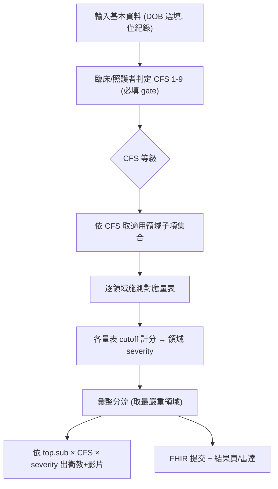

# 高齡周全性評估（CGA）改造 — 核心軸重模設計文件

**日期**: 2026-05-26
**狀態**: 設計中，待用戶 review（已過兩輪獨立審查並修正）
**範圍**: A（Phase 0 改名）＋ B（核心軸＋領域模型重做）＋ C（Phase 2 內容），合於本文件
**相關**: `src/lib/utils/age-groups.ts`, `src/lib/stores/assessment.svelte.ts`, `src/lib/education/schemas.ts`, `src/engine/cdsa/{triage,radar-scoring}.ts`, `src/lib/education/{trigger-derivation,matrix-data,age-fallback}.ts`, `scripts/{build-content-index,build-questionnaire-applicability}.ts`, `src/data/education/content-relevance.yaml`, `src/lib/db/{schema,recommendations,assessments}.ts`, `src/lib/fhir/{cdsa-resources,resources}.ts`, `src/lib/utils/loinc-map.ts`, `src/engine/closed-loop.ts`, `src/pages/education/index.astro`, `src/content.config.ts`, `workers/education-contribution/`

---

## 背景與目標

本專案 fork 自兒童發展智慧評估（CDSA + CDSS，Astro + Svelte 5 + IndexedDB/Dexie + SMART-on-FHIR，部署於 GitHub Pages），改造為**高齡周全性評估決策系統（smart-geri-cds）** — 開源、瀏覽器端、零後端。

容器（架構）整套重用；要換的是**領域內容**與**分層軸**。兒科以「年齡帶」為一級分層軸（發展里程碑強綁年齡）。但臨床指引（British Geriatrics Society, CGA Hub）明確指出 **CGA 是衰弱導向（CFS≥4 觸發完整 CGA）、非年齡導向**。本次不是「把年齡帶改值」，而是**把核心軸從年齡換成臨床衰弱量表（CFS），並完整重模領域與計分**。

**證據來源**：BGS CGA Hub（六大域、frailty-based）、衛福部臺中醫院/中亞健康網（台灣 CGA 面向）、Rockwood Clinical Frailty Scale v2.0（9 級）。

---

## 已確認決策

- **D1｜範圍**：完成 Phase 0–2（純問卷版上線）；Phase 3（感測/ML/常模重訓）另案延後。
- **D2｜分層軸**：核心軸從「年齡帶」整個重做為 **CFS 臨床衰弱量表**。
- **D3｜軸粒度**：CFS **完整 9 級，每級一欄**（`cfs1`…`cfs9`）。
- **D4｜CFS 時機**：**入口先篩（gate 型）** — 進入評估時由臨床/照護者判定，再 gate 後續適用領域、常模、建議。
- **D5｜領域框架**：完整 CGA，**二層結構** — BGS 六大頂層域，其下掛可獨立施測的子項。
- **D6｜重做方式**：**完整重模** — 正式雙軸模型（CFS × 領域），計分與常模徹底解耦。
- **D7｜文件範圍**：A＋B＋C 三塊納入這一份。
- **D8｜新識別**：專案/網域/PWA/DB 統一 `smart-geri-cds`，站名「高齡周全性評估」。
- **D9｜trigger 文法**：二層域以**兩個獨立路徑段**承載（`cga.domain.<top>.<sub>.anomaly.<cfs>`），解析器重寫。
- **D10｜Phase 3 感測模組**：純問卷版**移除**（非僅停用）game/voice/video/drawing 步驟與其引擎檔，避免 dead code 型別相依卡 `pnpm check`；Phase 3 以新的老年量測模組重新加回。

---

## ⚠️ 現況校正（審查發現的事實）

1. **網域已是專案網域**。`astro.config.mjs:11` `site:'https://smart-pedi-cds.yao.care'`；FHIR 常數 `cdsa-resources.ts:8-10` 為 `https://smart-pedi-cds.yao.care/{code,assessment,extension/...}`，display「CDSA 兒童發展智慧評估」。→ 改名是 `smart-pedi-cds`→`smart-geri-cds`（pedi→geri）。
2. **`deploy.yml:31-34` 的 `--base` 屬 lychee link-check**，非 Pagefind（`package.json:24` postbuild 是 `pagefind --site dist`）。
3. **Actions v3/v4→v5 升級與本次無關**，不納入本 spec。
4. **「統一內容關聯」重構已落地**：`build-content-index.ts` 為編譯器（輸出 triggers/educationSlugToTriggers/recommendations/clinicalEducation + 生成 `clinical-education.generated.ts`）；`closed-loop.ts` 讀該 generated 檔；`RecommendationsManager.svelte` 從 index 載 slug。皆綁兒科 trigger 格式 + `CDSA_DOMAIN_NAMES`。

---

## 架構（B）：雙軸模型

### 軸 1｜分層軸 = CFS 等級

值 `cfs1`…`cfs9`（每級一欄）；進入評估時由臨床/照護者判定；gate 適用領域、keys 建議/衛教、作詮釋脈絡；**不參與計分**。

CFS 9 級中文（暫譯，待臨床確認官方譯名，`clinicallyReviewed` 控管）：`cfs1` 非常健壯／`cfs2` 健壯／`cfs3` 大致良好／`cfs4` 極輕度衰弱／`cfs5` 輕度衰弱／`cfs6` 中度衰弱／`cfs7` 重度衰弱／`cfs8` 極重度衰弱／`cfs9` 末期。

### 軸 2｜領域軸 = 二層

邏輯識別碼 = `top` + `sub` 兩欄（顯示/分組用 `top.sub`）。

| 頂層域 | 子項 | 對應量表（授權見 C） |
|---|---|---|
| **physical** 生理/醫療 | `comorbidity`·`polypharmacy`·`nutrition`·`continence`·`sensory` | CCI·Beers/STOPP 旗標·MNA-SF·失禁篩檢·視聽篩檢 |
| **psychological** 心理/精神 | `cognition`·`mood`·`delirium` | SPMSQ·GDS-15·CAM |
| **functional** 功能 | `adl`·`iadl`·`mobility`·`falls` | Barthel·Lawton·步態自述/TUG·STEADI |
| **social** 社會 | `social_support`·`caregiver`·`financial` | 自述·Zarit 短版·自述 |
| **environmental** 環境 | `home_safety`·`accessibility` | 居家安全檢核·自述 |
| **future_wishes** 預立醫療 | `advance_care_planning`·`treatment_preferences` | ACP/AD 狀態·DNR/維生意願 |

共 6 頂層域、約 18 子項；矩陣最大 18 × 9 = 162 格，靠適用矩陣稀疏化。

### Trigger 文法與 schema（D9 + C5）

二層域以兩段承載，重寫解析器：

| 用途 | 兒科現況 | CGA 重模後 | 解析 |
|---|---|---|---|
| 領域異常 | `cdsa.domain.<domain>.anomaly.<age>` | `cga.domain.<top>.<sub>.anomaly.<cfs>` | `[cga,domain,top,sub,anomaly,cfs]` |
| 分流 | `cdsa.triage.<cat>.<age>` | `cga.triage.<cat>.<cfs>` | — |
| 生理指標(選用) | `cdss.<indicator>.<level>.<age>` | `cga.vital.<indicator>.<level>.<cfs>` | — |

- `matrix-data.ts`：`split('.')` 解析改 `parts[2]=top, parts[3]=sub, parts[4]==='anomaly', parts[5]=cfs`；`MatrixKey`=`${top}.${sub}:${cfsLevel}`；其硬寫的 `CDSA_DOMAINS` 改二層域來源。
- `build-content-index.ts`：domain regex 改 `^cga\.domain\.([^.]+)\.([^.]+)\.anomaly\.([^.]+)$`；`recommendations` key 改 `${sev}::${top}.${sub}::${cfsLevel}`；inapplicable 展開（行 153-158）改讀二層域 × cfsLevel。
- **`schemas.ts` `cdsaDomainEntrySchema`（C5，非僅改 refine 字串）**：目前 `domain: z.enum(CDSA_DOMAIN_NAMES)` 為**單欄 flat enum**，無法表達「18 個 sub 散在 6 個 top 下」的合法組合。改為新增 `top`（z.enum 六頂層）+ `sub`（z.enum 全部子項）兩欄，並以 **cross-field refine 驗證 top/sub 合法組合**（用一份 `DOMAIN_TREE: Record<top, sub[]>` 常數為單一源），refine 比對 `cga.domain.${top}.${sub}.anomaly.${cfs}`。`contentRelevanceSchema.inapplicable`（`:136`）的 key 由 `z.enum(CDSA_DOMAIN_NAMES)` 改為 `top.sub` 字串（以 refine 驗合法），value 由 `z.enum(AGE_GROUPS_CDSA)` 改 `z.enum(CFS_LEVELS)`。

### 進入流程（CFS gate）



### 兩個 gate（修正 eligibility 歧義）

- **DOB**：選填，僅供 FHIR/紀錄；不擋流程；65 歲以下顯示提示（非拒絕）。
- **CFS**：**必填 gate** — 未選不得開始。取代原 `isEligible(birthDate)` 在 ChildProfile 的擋送出角色；`isEligible()` 移除。

### 分層軸狀態流（M1：store wiring）

這是「改法可落地」的核心，須明確 wiring：

- `assessment.svelte.ts:55-57` 的 `ageGroup = $derived(birthDate ? ageGroupCDSA(...) : null)` **移除**。DOB 選填後不能再推導分層軸。
- **新增一級 state** `cfsLevel = $state<CfsLevel | null>(null)`，由 ChildProfile（將更名 `SubjectProfile`）的 CFS 選擇器寫入。
- **持久化**：`Assessment` schema 新增 `cfsLevel` 欄；`startNew()`/`createAssessment(childId, cfsLevel)` 寫入；`resume()` 自 `assessment.cfsLevel` 還原 `this.cfsLevel`（否則跨頁 result / resume 拿不到分層軸）。
- **消費端改讀 `cfsLevel`**（原讀 `ageGroup`）：`ResultView`/`ResultViewWrapper`/`ResultDetail` 的 `computeTriage({cfsLevel})`、`deriveCdsaTriggers(triageResult, cfsLevel)`、`EducationMatch cfsLevel=`；`QuestionnaireModule`（適用集合查 cfsLevel）；`video-lookup.ts`。**完整清單見〈受影響檔案總表〉**。

### 評估步驟與感測模組（M3 + D10）

- `STEPS`（`:11`）`['profile','questionnaire','game','voice','video','drawing','result']` → **縮為 `['profile','questionnaire','result']`**；`STEP_LABELS`、`SkippableModule` 對應縮減。
- `skippedModules`/`effectiveSteps`/`effectiveStepIndex`（`:63-90`，綁兒科域名 `gross_motor`/`fine_motor`/`language_*` 滿分跳過）**移除或簡化**（純問卷版只有 questionnaire，無可跳模組）。`nextStep`/`prevStep` 的 skip 迴圈隨之簡化。`forceFullAssessment` 相關（state/DAO/UI）一併移除。
- `instructionLevel()`（`age-groups.ts`）+ 兩個消費端 `GameModule.svelte:118`、`VoiceModule.svelte:60` 隨感測模組移除。
- `QuestionnaireModule.svelte:248-261` summary 區塊寫死「互動遊戲/影片錄製/繪圖/語音」建議 → 改寫為純問卷版用語。
- **移除感測引擎檔** `engine/cdsa/{gross-motor-analysis,drawing-analysis,voice-analysis,behavior-analysis}.ts` 及 store 對其型別的 import（`PartialAnalysis` 的 sensor 欄位），避免 `AgeGroupCDSA` 型別移除後 dead 檔 type-error。`assessment-analyzer.ts` 簡化為只跑問卷計分。另刪四個感測 `.svelte`（Game/Voice/Video/Drawing）並改 **`AssessmentShell.svelte`**（唯一 importer，含 `CardItem` 型別與 `effectiveStepIndex`）、`StepIndicator.svelte` 對齊 3 步——見〈受影響檔案總表〉。

---

## 計分與引擎重模（B）

把 z-score 常模換成 per-scale 驗證 cutoff，計分與分層軸解耦。

### 為什麼非換不可

CGA 量表（GDS-15、Barthel、MNA-SF、SPMSQ…）各有驗證過的固定切分點，不是對族群算 z-score。

### 新抽象：量表定義（data-driven）

新增 `src/data/scales/*.yaml`（Content Layer + Zod，須在 `content.config.ts` 註冊新 collection）：

```yaml
id: gds-15
domain: { top: psychological, sub: mood }
applicableCfs: [cfs3, cfs4, cfs5, cfs6, cfs7]
scoring: sum                      # sum | weighted | error-count | measured-value
inputType: option                 # option（沿用現有問卷 UI）| numeric（需新數值輸入元件）
maxScore: 15
bands:
  - { max: 4,  severity: normal,  label: "無憂鬱徵兆" }
  - { min: 5, max: 9, severity: monitor, label: "疑似憂鬱，建議追蹤" }
  - { min: 10, severity: refer, label: "高度疑似，建議轉介" }
clinicallyReviewed: false
```

### 各層去留（完整耦合清單）

| 兒科現況（檔案） | 重模後 |
|---|---|
| `triage.ts` `loadNorms()`/z-score | 移除；改 `scoreScale(scaleDef, answers)` 逐量表計分 |
| `triage.ts` `DOMAIN_LABELS`（單層） | 改二層 `top.sub` → 中文 |
| `triage.ts` 分流 gate | 改 **取各領域最嚴重者**（任一 refer→refer；有 monitor→monitor；全 normal→normal；全 incomplete→incomplete） |
| `triage.ts` `TriageResult.details`（`zScore/directionalZ/normMean/normStd/metric`） | 改 `{scaleId, domain:{top,sub}, rawScore, maxScore, severity, bandLabel}` |
| `radar-scoring.ts`（`zToPercentile`/`directionalZ`/hybrid 三路徑） | 簡化為純 `rawScore/maxScore` 正規化；移除 z 路徑與 hybrid |
| `RadarChart.svelte`（`domainLabels` 八域寫死、`isHybrid` prop） | 改二層域標籤；移除 `isHybrid`（無 hybrid 計分） |
| `ResultView.svelte` `computeDomainScores` 消費端 | 對齊新 details 形狀 + cfsLevel |
| `schema.ts` `NormThreshold` 表 + `normThresholds` index | 移除 |
| `schema.ts` `Assessment`：新增 `cfsLevel`、`triageResult.details` 型別、移除兒科欄 | 對齊 |
| `NormsManager.svelte` | Phase 2 停用 |
| `build-content-index.ts`（編譯器） | trigger 格式、`recommendations` key、`clinicalEducation`、inapplicable 展開、生成檔 全改 |
| `clinical-education.generated.ts` + `clinicalAlertEducation` 段 | 純問卷版**為空**（無 CDSS 指標）→ closed-loop 臨床警示自然停用 |
| `closed-loop.ts`（讀 `CLINICAL_EDUCATION`） | 邏輯保留；資料為空時不觸發 |
| `recommendations.ts` `DOMAINS=CDSA_DOMAIN_NAMES`、key、`mergeRecommendationsForContext` | 改二層域 + per-domain severity（見「結果頁取用」） |
| `RecommendationsManager.svelte` | 隨二層域 + index 格式更新 |
| `build-questionnaire-applicability.ts` + `expected-questionnaire-domains.generated.json` | 硬寫 6 域 7 齡 → 二層域 × cfsLevel；產物改「per-CFS 適用子項集合」 |
| `QuestionnaireModule.svelte`（消費上述 + option.score + summary） | 對齊新適用集合；summary 改寫；`numeric` inputType 需新元件 |
| `card-selector.ts` + `cardsCollection` | Phase 2 停用遊戲（見 C） |

### CFS 在計分中的角色

CFS **不改變量表 cutoff**。只做：gate 施測（`applicableCfs`）、keys 衛教/建議、結果詮釋。

### severity 列舉（含 incomplete）

`severity ∈ { normal, monitor, refer, incomplete }`。`incomplete`（作答不全）：**排除於「取最嚴重」彙整、不進 recommendations 查詢、但明確標示**；雷達以灰階/缺口呈現；FHIR **不發該量表 Observation**（或 `status='preliminary'` + `dataAbsentReason`）。**不可用 `interpretation=IE`** — IE 在 HL7 v3 ObservationInterpretation 是抗藥性檢測專用碼（「該物種非良好治療標的」），語義不符。

---

## 矩陣／內容關聯／結果頁

### 適用矩陣 = 稀疏化關鍵

`content-relevance.yaml` `inapplicable:` 從 `Record<domain, ageGroup[]>` → `Record<"top.sub", cfsLevel[]>`（同步 `schemas.ts:136` 與 `build-content-index.ts:153-158`）。**原則草案**（細格留 Phase 2 臨床審）：`future_wishes.*`/`psychological.delirium` 偏重 cfs5–9；`functional.adl/iadl` cfs4–9；`functional.mobility/falls` cfs3–7；cfs1–2 多數僅篩檢層或不評。

### Fallback

`age-fallback.ts` `CDSA_FALLBACK_CHAIN` → `cfs-fallback.ts` `CFS_FALLBACK_CHAIN`：某 CFS 級該格無內容時向相鄰級（cfs5→cfs4/cfs6）或「預設級」遞補。

### 結果頁 recommendations 取用（M4：per-domain severity）

兒科 `mergeRecommendationsForContext(tenant, 單一 category, domains[], ageGroup)`（`recommendations.ts:128`）是「整體 category × 所有異常域」模型。新分流輸出「每個 `top.sub` 各自一個 severity」，故改為：

- **逐域查詢**：對每個有結果的 `top.sub`，用**該域自身 severity** 查 `${tenant}::${severity}::${top.sub}`（default key `${severity}::${top.sub}::${cfsLevel}`），跨域 dedupe。
- **排除 `incomplete`**：不進 recommendations 查詢。
- **default key 含 CFS**（`getDefaultRecommendations`/`mergeRecommendations` 由 `ageGroup` 改 `cfsLevel`）；**overlay key 不含 CFS**（現為 `${tenant}::${category}::${domain}`，age-independent → 改 `${tenant}::${severity}::${top.sub}`，cfs-independent，沿用既有「default 分齡、overlay 不分齡」設計，**勿統一兩者**）；`domain` 一律改 `top.sub`。（注意：現有 `RecommendationCategory = 'normal'|'monitor'|'refer'` **即 severity enum**，此處僅更名 + `domain`→`top.sub`，非新增軸。）
- `EducationMatch.svelte` props 由「單一 `category` + `domains[]` + `ageGroup`」改為「`Array<{domain:top.sub, severity}>` + `cfsLevel`」（`ResultView` 與 `ResultViewWrapper` 兩個呼叫端同步改）。

### 矩陣頁

`education/index.astro`：列 = 18 子項（依 6 頂層域分組標頭），欄 = CFS 1–9。

---

## FHIR（A/B）

**兩條 FHIR 路徑分別處理**：

1. **CDSA 評估路徑** `cdsa-resources.ts` → `cga-resources.ts`：常數 `CODE_SYSTEM`/`ID_SYSTEM`/`CONFIDENCE_EXT_URL`（`:8-10`）`smart-pedi-cds`→`smart-geri-cds`；`REPORT_CODE.display`/`observationCode` 的 `CDSA`/「兒童發展智慧評估」→「高齡周全性評估」。Observation 一量表一筆（識別碼 `${assessmentId}::${top}.${sub}::${scaleId}`，value=原始分，取代 `:79-96` 的 `zScore`/`unit:'z-score'`，`interpretation` 依 severity：normal=N、monitor/refer=A；incomplete 則不發該筆或用 `status='preliminary'`+`dataAbsentReason`（**不可用 `interpretation=IE`**，見 severity 段）)。**新增 CFS Observation**：先用本地 code system（`smart-geri-cds/code` 下 `clinical-frailty-scale`）；LOINC/SNOMED 標準碼對應**標為待術語確認的後續項**（無確定單一官方 CFS concept，不卡上線）。`DiagnosticReport` conclusion = 整體分流 + 各領域 severity；referral code 沿用 `3457005`。

2. **CDSS 生理路徑** `resources.ts` + `loinc-map.ts` + `date.ts` 的 `AgeGroup`（**另一條兒科年齡軸 `'infant'|'toddler'|'preschool'`，與 CDSA 軸平行**）：純問卷版**不啟用**。但 `WorkspaceShell.svelte` 在 `/workspace/` 仍 reachable 地渲染 `PatientList`/`PatientView`（經 FHIR 連線 gate），它們走 `deriveCdssTriggers(patient.ageGroup)` 並顯示兒科年齡標籤。**Phase 2 處置：隱藏/移除 workspace 的 patient 與 alerts 分頁（`PatientList`/`PatientView`/`RiskSummary`/`AlertFeed`/`AlertManager`）**，CDSS 老年化延 Phase 3。type 層面走獨立的兒科 CDSS 年齡型別（**概念名 `AgeGroupCDSS`；實際為 `db/schema.ts` inline union `'infant'|'toddler'|'preschool'` + `date.ts` 的 `AgeGroup` + `trigger-derivation.ts` local type**），移除 `AgeGroupCDSA` 不影響其編譯，故不卡 build，僅屬可見一致性債。

維持 CLAUDE.md：PDF/console 不輸出 PII，FHIR 僅用 Patient ID。

---

## Phase 0 改名（A）

| 檔案 | 改什麼 |
|---|---|
| `package.json` | `name:cdss-pediatric`→`smart-geri-cds`、description→高齡 |
| `astro.config.mjs:11` | `site:` pedi→geri 網域 |
| `scripts/base.mjs` | `BASE_PATH` 維持空；`THEME_COLOR` 不變 |
| `.github/workflows/deploy.yml:34` | **lychee** `--base`→geri 網域 |
| `public/CNAME` | `smart-pedi-cds.yao.care` → `smart-geri-cds.yao.care`（GitHub Pages 自訂網域，**第六輪後補列**） |
| `src/lib/db/schema.ts` | DB 名→`smart-geri-cds`（見遷移） |
| `scripts/templates/manifest.template.json` | PWA `name` |
| `cdsa-resources.ts`→`cga-resources.ts` | 三常數 URL + display |

> 可見文案改寫歸 C；Actions v5 升級不在本 spec。

---

## 資料庫遷移（Dexie）

- **DB 名改變 = 全新資料庫**，刻意不遷兒科資料 → 以新 DB 名建乾淨 v1。
- v1 變動：移除 `NormThreshold` 表/index；`Assessment` 新增 `cfsLevel`、移除 `forceFullAssessment` 等兒科欄、`triageResult.details` 改新形狀；assessment 記錄 `domain` 改 `{top,sub}`。
- Dexie 版本鏈在新 DB 名下重置 v1。offline sync queue／BroadcastChannel 結構不受影響。

---

## Phase 2 內容（C）

### 量表（授權是硬約束）

- ✅ 建議：**SPMSQ**（認知，免費，優於 MMSE）、**GDS-15**、**Barthel**、**Lawton**、**MNA-SF**、**STEADI**（CDC 公領域）、**CAM**、**CCI**、**Zarit 短版**。
- ⚠️ 避免：**MMSE**（PAR 版權）、**MoCA**（需註冊/訓練）。
- 題目/計分/cutoff 以 `clinicallyReviewed` 控管，臨床簽核才落地。

### 輸入元件（measured-value 需新 UI）

現有 `QuestionnaireModule` 只支援**選項計分**（`option.score`）。Phase 2 **行動/跌倒採自述選項題**（STEADI、跌倒史），沿用現有 UI；`scoring: measured-value`（gait/TUG 連續數值）**需新數值輸入元件**，列 Phase 2 後段或延 Phase 3（`inputType: numeric` 標記）。

### 貢獻流程（M2：需改，非原封不動）

二層域 + CFS 後，矩陣→modal→worker→trigger 全鏈承載舊軸，須一併改：

- `education/index.astro:112-158` 矩陣格 `data-domain`/`data-age` → 承載 `top.sub` + `cfsLevel`（或合併單一 cell key）。
- `ContributionModal.svelte:54-160` 欄位 `domain`+`age` → 新軸。
- `workers/education-contribution/src/index.ts:28` 後端 `VALID_AGES` 驗證 + payload schema → CFS 集合 + 二層域。
- `issue-formatter.ts:154` trigger 建構 `cdsa.domain.${domain}.anomaly.${ageGroup}` → `cga.domain.${top}.${sub}.anomaly.${cfs}`；模板「發展領域」用語；yamlHint 寫死舊路徑 `education-videos/cdsa-domains.yaml` → `content-relevance.yaml`。
- `issue-formatter.test.ts`（年齡帶 fixture）→ 新軸。

### 其他內容

- **衛教文章** `src/data/education/*.md`：重寫高齡主題，刪兒科文章（含 `milestones/`）。
- **影片** `video-catalog/*.yaml` + 重新 curate（`scripts/curate/{channel-seeds,keywords}.json`）。
- **適用表** `content-relevance.yaml` `inapplicable`（二層域 × cfsLevel，待臨床審）。
- **遊戲卡**：Phase 2 停用。`content.config.ts:109` `cardsCollection` **保留定義、`src/data/cards/index.json` 清空為合法空集**（避免動 content config 牽連 build 驗證）；`card-selector.ts` 與 `tests/engine/card-selector.test.ts` **刪除**（非 skip）。
- **可見文案（C4）**：`AssessmentPdfReport.svelte` 標題「兒童發展智慧評估報告」（`:82`）、頁尾「CDSA…系統」（`:139`）、filename `cdsa-report-`（`:141`）→ CGA 用語；順手修 `statusLabelsCn`（`:23-27`）與 DB `AssessmentStatus`（`started/paused/resumed/completed/incomplete`）對不上的既有小 bug（`fhir/assessment-fetch.ts:87` 有經 `as Assessment` cast 掩蓋的同類既有 bug，一併修）。其餘站名/標題/description（Base/Assess/Header/index/about）一併重寫。

---

## 受影響檔案總表（grep 枚舉全消費端）

為避免逐輪才發現新消費端，以下用 grep 一次枚舉 `ageGroupCDSA / AgeGroupCDSA / AGE_GROUPS_CDSA / deriveCdsaTriggers / EducationMatch / getCollection('cards') / NormThreshold / instructionLevel` 全部命中：

**分層軸（ageGroup→cfsLevel）共 18 處**：源 `age-groups.ts`(→`cfs-levels.ts`)、`schemas.ts`、`matrix-data.ts`、`trigger-derivation.ts`、`video-lookup.ts`、`recommendations.ts`、`db/schema.ts`、`stores/assessment.svelte.ts`、`education/index.astro`、`NormsManager.svelte`、`RecommendationsManager.svelte`、`QuestionnaireModule.svelte`、`ChildProfile.svelte`(→`SubjectProfile`)、`EducationMatch.svelte`、`age-fallback.ts`(→`cfs-fallback.ts`)，**結果頁三件**見下。`video-lookup.ts` 為前兩輪未捕捉的消費端。

**結果頁三件（皆讀 `deriveCdsaTriggers` + `EducationMatch` + inline domain scores）**：`ResultView.svelte`、**`ResultViewWrapper.svelte`（MF-1，standalone `/result/?id=`）**、**`ResultDetail.svelte` + `pages/workspace/result/`（MF-2，醫師端細節頁，render `normMean±normStd`/`zScore`/`directionalZ`/`METRIC_LABELS`）**。三者全對齊新 `details {scaleId, domain:{top,sub}, rawScore, maxScore, severity, bandLabel}`、cfsLevel（讀 `assessment.cfsLevel`，不再由 birthDate 推導）、EducationMatch 新 props、移除常模欄位渲染。

**感測模組移除（MF-3 / D10）**：刪 `GameModule/VoiceModule/VideoModule/DrawingModule.svelte` + 引擎檔 `gross-motor-analysis/drawing-analysis/voice-analysis/behavior-analysis.ts`；**`AssessmentShell.svelte`**（唯一 import 四感測元件 + `CardItem` 型別 + 用 `effectiveStepIndex` 的中央編排器）移除對應 import/render 分支、改用縮減 steps；`StepIndicator.svelte` 對齊 3 步；`instructionLevel` + 消費端（GameModule/VoiceModule）隨之移除。

**NormThreshold 移除**：`triage.ts`、`db/schema.ts`、`NormsManager.svelte`（停用）、**`SystemGuide.svelte`**（說明文字引用，需改）。

**cards 停用三頁**：`assess.astro`（隨 AssessmentShell 改）、`admin/card-review.astro`、`about/illustration-credits.astro`。`index.json` 清空為合法空集後三頁優雅退化；**決定：保留三頁（空集合下優雅退化），不移除**。

**DAO（`assessments.ts`）**：`createAssessment` 加 `cfsLevel` 參數、`resume` 還原 `cfsLevel`、移除 `updateAssessmentForceFull`。

**第二條兒科年齡軸（CDSS：`'infant'|'toddler'|'preschool'`，獨立型別，故 CDSA 軸 grep 未含）**：`date.ts` `AgeGroup`/`ageGroup()`、`schema.ts` `Patient.ageGroup`(inline union)、`schemas.ts` `CDSS_AGE_ENUM`、`trigger-derivation.ts` `deriveCdssTriggers`(+local `AgeGroupCDSS`)、`resources.ts`、`rule-engine.worker.ts`、`PatientList.svelte`/`PatientView.svelte`、`WorkspaceShell.svelte`(patient+alerts 分頁)、`EducationManager.svelte`（`CustomEducation.ageGroup` 寫死 `['infant','toddler','preschool']`）。Phase 2 隨 CDSS path 一併停用/隱藏（見 FHIR 段）；`CustomEducation.ageGroup` 與 workspace patient 分頁建議隱藏、Phase 3 老年化。

**DOB 改選填的 null-guard**：`ageInMonths()` 消費端 `AssessmentHistory.svelte`、`AssessmentPdfReport.svelte`、`ChildProfile.svelte`(→`SubjectProfile`) 須處理 birthDate 缺值（避免 `new Date(undefined)`→NaN）。

---

## 測試守門

- `tests/utils/age-groups.test.ts` → 重寫 `cfs-levels.test.ts`（CFS 對應，無年齡邊界/`instructionLevel`）。
- `tests/engine/triage.test.ts` → 重寫為 **per-scale cutoff 計分**（band→severity、取最嚴重、incomplete 行為）。**引擎走 TDD：先寫量表計分測試再實作**。
- `tests/education/content-index-parity.test.ts` → **整支重寫**：key regex `^(normal|monitor|refer)::[a-z_]+::[0-9]+-[0-9]+m$` 改為 **`^(normal|monitor|refer)::[a-z_]+\.[a-z_]+::cfs[1-9]$`**；`EXPECTED_SLUGS`、`DOMAINS`/`AGE_GROUPS` coverage guard 全換。
- `tests/education/matrix-data.test.ts`、`tests/lib/education/trigger-derivation.test.ts` → 二層域 × cfsLevel。
- `tests/components/QuestionnaireFlow.test.ts`、`tests/data/questionnaire-coverage.test.ts`、**`tests/components/QuestionnaireModule.test.ts`**（現靠 `store.ageGroup` 驅動）→ 改 cfsLevel 驅動 + DOB 選填 + summary 文案。
- **刪除**（引擎檔移除）：`tests/engine/card-selector.test.ts`、`tests/engine/{behavior-analysis,drawing-analysis,voice-analysis}.test.ts`。
- `education-slug-integrity`、`trigger-uniqueness`：對新 slug/trigger 更新。
- `workers/education-contribution` 測試：對新軸更新。
- **刪除**（API 移除）：`tests/lib/stores/assessment-force-full.test.ts`（forceFull 移除）。
- **重寫/刪**（z 路徑移除）：`tests/engine/radar-scoring.test.ts`（import `zToPercentile`、斷言 `directionalZ`/`zScore`）。
- **重寫**：`tests/engine/assessment-analyzer.test.ts`（斷言 sensor metrics）、`tests/engine/closed-loop-education.test.ts`（`CLINICAL_EDUCATION` parity→空）、`tests/lib/education/schemas.test.ts`（`cdsaDomainEntrySchema` flat enum→top/sub）、**`tests/db/recommendations-age.test.ts` 與 `tests/lib/db/recommendations.test.ts`**（兩支不同檔，皆 age-keyed → 改 key 格式、`DOMAINS` coverage、簽章 `ageGroup`→`cfsLevel`、`domain`→`top.sub`）、`tests/components/{ResultView,ChildProfile}.test.ts`（ageGroup gate / isEligible / details 形狀 / CFS 選擇器）、`tests/lib/education/video-lookup.test.ts`（`AGE_GROUPS_CDSA` regex/fallback）、`tests/components/RadarChart.test.ts`（移除 `isHybrid`，改二層域）。

---

## 錯誤處理

- **CFS 未輸入** → 擋住評估開始（必填 gate），顯示提示。
- **量表作答不全** → severity=`incomplete`、排除彙整與 recommendations、但明確標示，不假裝 normal。
- **量表定義無效** → build 期 Zod 擋下；runtime 記警告跳過（不輸出 PII）。
- **適用格無內容** → fallback chain；仍空 → 「尚無內容」＋貢獻入口開 issue。
- **cfs1–2 多數子項不評** → 結果頁仍給篩檢層結果＋健康維持衛教，不留白。

---

## 範圍與非目標

- **Phase 3 感測模組移除**（D10）；Phase 3 以新老年量測模組加回。
- **CDSS 生理分支** Phase 2 不啟用，保留 dead。
- **常模重訓、`risk-model.onnx`、量表 LOINC/SNOMED 標準碼、CFS 標準碼、NormsManager、measured-value 元件** — 延後/後段。
- **GitHub Actions v3/v4→v5 升級** — 獨立 CI 維護，不在本 spec。

---

## 原封不動帶走（容器）

content-relevance 單一源 + 三視圖投影框架（編譯器內部改、架構不變）；SMART-on-FHIR 連線層（除 `cga-resources` 內容）；IndexedDB/Dexie 框架（除 schema 變動）；多租戶 `tenant.ts`；PDF 字型 `font-loader.ts`；Pagefind；預警等級 token；規則引擎/基線/ML worker 框架；CI/部署 pipeline（除 lychee `--base` 字串）。
> 注意：貢獻流程（worker + modal + 矩陣按鈕）**不在**此清單，見 C 段 M2。

---

## 待確認項（spec review 時定）

1. **npm `name`**：建議統一 `smart-geri-cds`。
2. **CFS 官方中文譯名**：是否採台灣老年醫學會/衛福部既有譯本。
3. **領域子項增刪**：18 子項是否增（`pain`/`sleep`）或減。
4. **適用表 CFS 範圍**：原則草案是否符合臨床預期。
5. **生理指標分支**：Phase 2 完全不放，或保留少數（血壓/體重）。
6. **measured-value 元件**：gait/TUG 數值輸入是 Phase 2 後段或延 Phase 3。
