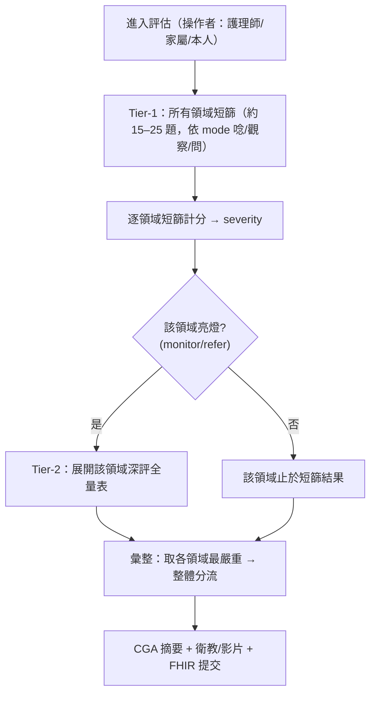

# 高齡 CGA 評估改造為「問答式臨床資料蒐集 + 自動分層」— 設計文件

**日期**: 2026-05-27
**狀態**: 設計中，待用戶 review
**相關**: `src/data/scales/*.yaml`, `src/lib/scales/scale.ts`, `src/components/assess/QuestionnaireModule.svelte`, `src/lib/stores/assessment.svelte.ts`, `src/content.config.ts`, `src/engine/cdsa/triage.ts`, `src/lib/db/schema.ts`

---

## 背景：先前設計的根本錯誤

第一版把 19 個量表全部當成「長者自己點選項」的問卷，造成兩個被用戶點名的嚴重問題：

1. **題目措辭錯誤**：把施測者主導的測驗壓成 meta 摘要，例如 4AT 的「AMT4 四題：詢問年齡、出生年月日、目前地點、今年年份，計算答錯題數」——誰答都不清楚。
2. **負擔不可行**：某 CFS 級「適用」的全部量表一次全上 → **78–116 題**（cfs4=107），對衰弱長者根本做不完（「審問犯人」）。

**根因**：誤判工具角色。SPMSQ/4AT/Barthel 等本來就是**用問的/觀察的**（護理師唸題、病人答、護理師記分；4AT 警醒度是觀察）。我卻當成「長者無人協助自點」，又無分層。

## 已確認決策

- **D1｜角色**：本工具是**協助護理師/醫師的「問答式臨床資料蒐集前端」**。操作者可為護理師、家屬或長者本人；本質是「**唸題/觀察 → 記錄答案**」，由系統結構化、自動計分、產出 CGA 摘要供臨床判讀。**保留標準量表，不移除**。
- **D2｜負擔**：**自動分層**。每領域先短篩（Tier-1），亮燈（severity ≥ monitor）才展開該領域深評全量表（Tier-2）。
- **D3｜施測模式標註**：每題標 `mode`，介面依此呈現操作者提示語（而非「長者自己點」）。
- **D4｜題目措辭重做**：把每題寫成操作者實際會唸/觀察/問的內容；多選項子測驗（如 AMT4）列出實際子題。
- **D5｜clinicallyReviewed 全部重設為 false**：內容大改，所有量表回到未審，待重做完成後再由臨床逐一簽核（撤銷先前 10 支誤標的 true）。

---

## 資料模型

### 題目層：新增 `mode` 與操作者提示

```yaml
items:
  - id: <id>
    mode: ask-patient        # ask-patient | observe | ask-informant | measure
    prompt: <操作者提示語>     # 「請唸給受測者…」「請觀察…」「請問家屬…」「請測量…」
    subquestions: [...]      # 選用：多子題（如 AMT4 的 4 題）
    options:
      - { label: ..., score: N }
```

- `mode` 決定 UI 呈現：
  - `ask-patient`：顯示「請唸給受測者並記錄其回答」+ 題目。
  - `observe`：顯示「請操作者觀察並記錄」+ 觀察重點。
  - `ask-informant`：顯示「請詢問家屬/照顧者」+ 題目（無家屬時可標記「無法取得」）。
  - `measure`：顯示數值/量測輸入（如 BMI、或既有的攝影計時）。
- `text` 改為 `prompt`（操作者面向）；`subquestions` 供列出子題。

### 量表層：新增 `tier` 與分層關聯

```yaml
tier: screen               # screen | full
domain: { top, sub }
expandsTo: <fullScaleId>   # 僅 screen：亮燈時展開的深評量表 id（可省略＝無深評）
```

- `tier: screen`：短篩（1–2 題），一律施測。
- `tier: full`：深評全量表，**僅當其領域的 screen severity ≥ monitor 時才出現**。
- 每領域＝1 個 screen（必出）+ 0–1 個 full（條件出）。

---

## 分層流程（引擎）



`QuestionnaireModule` 改造：先跑全部 screen → 計算各領域 severity → 對亮燈領域插入其 `expandsTo` full 量表 → 續跑 → 彙整。`triage`/`aggregateSeverity`/結果頁不變（仍吃 ScaleResult[]）。

---

## 全領域 短篩 → 深評 對應表（內容設計）

> 題目/切分點為設計骨架，實際題目與 cutoff 於實作時依公開量表填入，**clinicallyReviewed:false** 待臨床簽核。

| 領域 (top.sub) | Tier-1 短篩（mode） | 亮燈→Tier-2 深評（mode） |
|---|---|---|
| psychological.cognition | **AD8 知情者問卷**(ask-informant)；**無知情者→Mini-Cog**（三詞記憶+畫鐘, ask-patient+observe，客觀避免無病識感假陰性）。**不用病人主觀自評** | **SPMSQ**(ask-patient，含教育校正，見 C-M4) |
| psychological.mood | **PHQ-2** 2 題(ask-patient)；觸及自傷/絕望→**立即安全提示+轉介紅旗**(C-S2) | **GDS-15**(ask-patient) |
| psychological.delirium | **不設守門短篩——4AT 直接做**（警醒度 observe 近零負擔）。譫妄是急症、低活躍型與無家屬時易漏，不可靠 informant 守門 | （4AT 即此格內容；陽性→「先疑譫妄、找可逆病因」紅旗，非逕歸失智） |
| functional.adl | 自我照顧是否需協助 1 題（ask-patient/informant） | **Barthel**（ask-patient/informant 逐項） |
| functional.iadl | 工具性活動是否需協助 1 題 | **Lawton**（ask-patient/informant） |
| functional.mobility | 行走/起身困難 1 題 | **坐立測試**（measure＝攝影計時，已建）或自述 |
| functional.falls | **STEADI** 3 題(ask-patient)：**跌倒史或不穩任一「是」→ refer(at-risk)**、僅擔心跌倒→monitor（修正原本 1 題=monitor 低估） | 陽性→觸發 **mobility 步態/坐立測試(TUG/sit-to-stand)** |
| physical.nutrition | 近 3 月食量/體重下降 1 題（ask-patient） | **MNA-SF**（ask-patient + measure BMI） |
| physical.comorbidity | 慢性病種數 1 題（ask-patient/informant） | **CCI** 共病勾選（ask-patient/informant/病歷） |
| physical.polypharmacy | 每日固定用藥種數 1 題（數藥盒, ask-patient/informant） | 高風險藥(Beers)**改 ask-informant/病歷核對**、降權（不再單題即推 refer） |
| physical.continence | 漏尿困擾 1 題（ask-patient） | 失禁短篩展開 |
| physical.sensory | 視力/聽力困難 2 題（ask-patient） | 直接，無另設深評 |
| **physical.pain（新增, C-S1）** | NRS 0–10 或臉譜 1 題(ask-patient)；認知障礙者用 **PAINAD**(observe) | 直接 |
| social.social_support | 社會接觸 1 題（ask-patient） | **LSNS-6**（ask-patient） |
| social.caregiver | （若有照顧者）負荷 1 題（ask-informant＝照顧者） | **Zarit-12**（ask-informant） |
| social.financial | 經濟壓力 1 題 | 直接 |
| environmental.home_safety | 居家跌倒危害 1 題 | 居家安全檢核展開 |
| environmental.accessibility | 輔具/可及性 1 題 | 直接 |
| future_wishes.advance_care_planning | 是否已做 ACP/指定代理人 1 題 | ACP 狀態展開 |
| future_wishes.treatment_preferences | 是否已表達治療/DNR 意願 1 題 | 展開 |

**負擔**：Tier-1 全領域約 **15–25 題**；只有亮燈領域展開深評。

---

## 4AT 工作範例（改前→改後）

改前（壞）：`text: AMT4 四題：詢問年齡、出生年月日、目前地點、今年年份，計算答錯題數。`

改後（mode + 操作者提示 + 列子題）：
```yaml
id: 4at
tier: full
domain: { top: psychological, sub: delirium }
items:
  - id: at4_alertness
    mode: observe
    prompt: 觀察受測者警醒程度（互動中是否嗜睡難喚醒或過度躁動）
    options: [{label: 正常（清醒穩定）, score: 0}, {label: 輕度嗜睡<10秒恢復, score: 0}, {label: 明顯異常, score: 4}]
  - id: at4_amt4
    mode: ask-patient
    prompt: 請依序詢問下列 4 題，記錄答錯題數
    subquestions: [您今年幾歲？, 您的出生年月日？, 這裡是什麼地方？, 今年是哪一年？]
    options: [{label: 全對, score: 0}, {label: 錯1題, score: 1}, {label: 錯≥2題, score: 2}]
  - id: at4_attention
    mode: ask-patient
    prompt: 請受測者從 12 月開始倒著唸出月份（12、11、10…）
    options: [{label: 正確≥7個月, score: 0}, {label: <7或有錯, score: 1}, {label: 無法開始, score: 2}]
  - id: at4_acute
    mode: ask-informant
    prompt: 請問家屬或查閱：過去兩週內出現、且過去 24 小時仍存在的急性意識/認知/行為變化或波動？
    options: [{label: 否, score: 0}, {label: 是, score: 4}]
```

---

## UI 改造

- `QuestionnaireModule`：依 `mode` 顯示對應外框與提示（唸題/觀察/問家屬/量測），標題從「請回答」改為「**操作者：請依下列方式取得並記錄**」。`subquestions` 以清單呈現。`ask-informant` 題在「無家屬同行」時可標「無法取得」（severity=incomplete）。
- 進入評估時詢問「**本次由誰協助填寫**：護理師／家屬／長者本人」（記錄於 Assessment，供報告標示，不改題目內容）。
- `measure` 已有先例（坐立測試攝影計時）。

## 受影響檔案（重做範圍）

- `src/lib/scales/scale.ts`：`ScaleItem` 加 `mode`/`prompt`/`subquestions`；`ScaleDef` 加 `tier`/`expandsTo`。
- `src/content.config.ts`：scales collection Zod 對應新欄位。
- 全 19 個 `src/data/scales/*.yaml` + 新增各領域 screen 量表：依對應表重寫（mode、prompt、tier、子題），`clinicallyReviewed:false`。
- `src/components/assess/QuestionnaireModule.svelte`：分層流程（screen→亮燈→full）、依 mode 渲染、操作者框架。
- `src/lib/stores/assessment.svelte.ts`：記錄「操作者身分」；分層狀態。
- `src/data/education/content-relevance.yaml` 的 inapplicable/triggers：對齊新的領域×CFS 適用（screen 一律出、full 條件出）。
- 結果頁/triage：不變（仍 ScaleResult[] + aggregateSeverity）。
- `MobilityTaskModule`：成為 mobility 的 `measure` 深評（既有，接上 tier）。

## clinicallyReviewed 處理

撤銷先前部署的 10 支 `true` → 全部 `false`（內容已大改、待重審）。臨床簽核於重做完成後另行進行。

## 臨床審核（老年科護理師獨立 Opus）— 修正納入

審核總評「需修正」（方向正確，但有病安/效度硬傷）。以下逐項納入：

**必須修正（病安/效度）：**
- **C-M1 譫妄不可靠短篩守門**：4AT 直接做（不設 informant 守門）；警醒度 observe 近零負擔。低活躍型、無家屬時靠 1 題會假陰性漏掉敗血/藥物中毒急症。→ 已改對應表。
- **C-M2 認知短篩會被無病識感失智者穿透**：短篩用標準化 **AD8 知情者**；無知情者→**Mini-Cog 客觀測驗**（非病人主觀自評）；SPMSQ 留 Tier-2。→ 已改對應表。
- **C-M3 4AT/AMT4 措辭與計分**：列出 4 子題（年齡/出生年月日/地點/年份），「地點」prompt 註明醫院/建築/城市任一正確即算對；計分 0/1/≥2 錯保留（原版正確）。實作時務必把 `4at.yaml` 舊 meta 句改為 subquestions。
- **C-M4 SPMSQ 強制計分規則（目前缺）**：①**教育校正**（國小以下多允許錯 1、高中以上少允許錯 1）必須納入計分或報告標示，否則低教育假陽性、高教育假陰性；②「20 連續減 3」需全程正確才算對；③「現任/前任總統」等需在 UI 給操作者**正解提示**，否則家屬施測無從判分。
- **C-M5 STEADI 切分點低估跌倒史**：跌倒史或不穩任一「是」→ refer（at-risk）；陽性觸發步態/坐立測試。→ 已改對應表（原 yaml `1=monitor` 要改）。
- **C-M6 操作者身分＝硬效度閘門（非僅標示）**：當操作者=家屬而題目屬「需病人本人」之認知/情緒測驗（SPMSQ/4AT-AMT4/注意力/Mini-Cog/PHQ-2/GDS）→ 標 `invalid/incomplete` 並於報告警示「代理人作答、效度存疑」，**不靜默計分**；Zarit 必須照顧者本人填。→ 見資料模型「操作者效度閘門」。
- **C-M7 clinicallyReviewed 仍 true**：已全部退回 false（commit 949aae3 已部署）。

**臨床建議（納入）：**
- **C-S1 補領域**：新增 `physical.pain`（NRS/臉譜，認知障礙用 PAINAD observe）——最該補。並建議補 `sleep`（1 題）、`oral`（口腔/咀嚼/口乾 1 題）、高 CFS(6–9) 臥床者 `skin`（Braden, observe/measure）。報告層明確「4AT 陽性+急性起伏→先疑譫妄找可逆病因，非失智」。
- **C-S2 自傷/絕望紅旗**：PHQ-2/GDS 觸及自殺意念或絕望→**立即安全提示＋轉介路徑**，不只計入總分。
- **C-S3 切分點微調**：MNA 無法測 BMI 時用小腿圍 CC<31cm 替代題；Barthel 可考慮 cfs2 起（早期 ADL 退化）。
- **C-S4 per-item mode**：Barthel/Lawton **逐項可不同 mode**（移位/行走/上下樓→observe 優先；購物/理財/電話→ask-patient/informant）；MNA 行動/神經精神項為 observe/病歷判定。
- **C-S5 polypharmacy 高風險藥自評效度低**：改 ask-informant/病歷、降權。→ 已改對應表。
- **C-S6 直接深評（不靠短篩）**：delirium、已知失智/住院長者之 cognition、跌倒史陽性之 falls，應 bypass 短篩直接深評；ask-informant「無家屬→incomplete」**不可用於 delirium/cognition**（最危險個案反被靜默跳過）。

## 資料模型補充：操作者效度閘門（C-M6）

進入評估記錄 `operator: nurse | family | self`。每題/量表標 `requiresPatient: true`（認知/情緒等需本人作答者）或 `requiresInformant: true`（Zarit 等需照顧者）。`scoreScale` 與彙整時：若 `operator` 與 `requiresPatient/Informant` 不符 → 該量表 severity=`incomplete` 並附 `invalidReason`，結果頁與 FHIR 標示「代理人作答、效度存疑」，**不計入可信分流**。

## 測試

- scale schema 測試：新欄位（mode/tier/expandsTo/subquestions）。
- 引擎：screen→亮燈→full 展開邏輯（TDD：短篩 normal→不展開；monitor/refer→展開對應 full）。
- QuestionnaireModule：依 mode 渲染、分層流程、ask-informant 無家屬→incomplete。
- 守門：content-index-parity / questionnaire-coverage 對齊新結構。
- **臨床行為（TDD）**：操作者=family + 需本人測驗 → severity=incomplete+警示（C-M6）；STEADI 跌倒史「是」→ refer（C-M5）；delirium 4AT 直接出（無守門, C-M1）；cognition 無知情者→Mini-Cog 而非主觀題（C-M2）；自傷/絕望作答→安全提示（C-S2）。
- playwright：跑一次（短篩全 normal→題數 ~20；某領域亮燈→展開深評；family 操作 + 認知測驗→標效度存疑）。

## 範圍與非目標

- 本次＝評估「內容模型 + 分層 + 施測模式 + UI 框架」重做。架構軸（CFS/二層域/per-scale 計分/FHIR/影片/Worker）不變。
- 量表題目/切分點的臨床最終簽核仍待臨床（clinicallyReviewed）。
- 深評工具的完整題目以公開標準量表為準，實作時填入。
