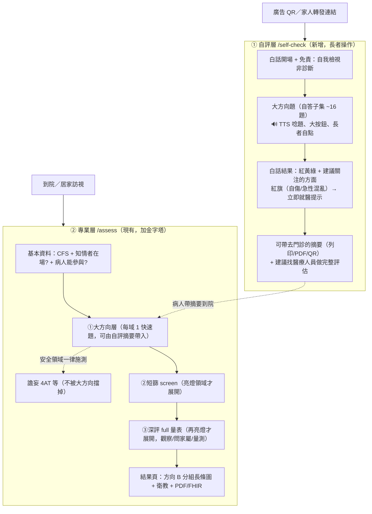

# 雙軌（民眾自評 + 專業評估）＋ 三層金字塔分流 設計文件

- 日期：2026-05-29
- 狀態：設計待 review
- 範圍：高齡周全性評估（CGA）系統 smart-geri-cds

## 背景與動機

使用者針對現行評估系統提出四個問題：

1. **問卷文案重複**：譫妄題標頭一次出現三行近乎同義的指示（MODE_FRAME title、MODE_FRAME hint、YAML prompt），視覺上像在重複同一句話。
2. **「操作者唸題」應改為電腦語音播放**：希望由電腦 TTS 朗讀題目。
3. **題目太長**：所謂「短篩 screen」階段對 cfs5 就有 46 題，沒有更上層的「大方向」分流；使用者希望「先做大方向，有需要再詳細做」。
4. **雷達圖無法閱讀**：結果頁 20 軸雷達圖標籤全部互相重疊。

釐清過程中，使用者進一步說明 TTS 的真正使用情境是 **民眾自評**：
- 家庭成員看到後轉發給長者進行；
- 長者在廣告中看到後自行測驗。

這把產品定位從「純臨床人員操作」擴張為**雙受眾**。經討論確認採**雙軌**（自評層 + 專業層並存），而非全面轉成民眾自評。

## 核心限制：自評不可宣稱臨床效度

現行 32 量表是先前刻意依臨床 SOP、由專業人員操作而重建（見 `2026-05-27-self-assessment-tiered-redesign-design.md` 與記憶教訓「臨床流程要查真實 SOP、別自創 operator 模型」）。許多題目**長者獨自無法施作或自答無效度**：

- **譫妄 4AT**：警醒度需旁人觀察；譫妄者本質上無法可靠自評。
- **Barthel / Lawton**：標準做法是觀察 + 問家屬。
- **Zarit-12（照顧者負荷）**：受測對象是照顧者，不是長者本人。
- **AMT4 / 注意力**：長者可作答，但答對與否需他人判定計分。

因此自評層**不得**是同一套量表，且**不得**宣稱診斷效度。自評層只收「能自答且自答有意義」的題目，定位為**自我檢視篩檢**，亮燈即導向專業評估。

## 已確認的設計決策

| 決策點 | 選擇 |
|---|---|
| 產品定位 | 雙軌：自評層（民眾）+ 專業層（醫療人員）並存 |
| 分層策略 | 三層金字塔：在現有 screen 之上新增「大方向層」 |
| 自評層語音 | 電腦 TTS 唸題、長者自己點答 |
| 結果頁面向視覺化 | 方向 B：分組水平長條清單（取代雷達圖） |

## 架構總覽

兩個入口，共用一份「大方向層」題庫；自評層只取其中「能自答」的子集。

## 元件設計

### A. 大方向層題庫（共用）

新增一層 `tier: 'triage'` 的量表，**每個領域 1 題**（少數可 2 題），以**白話、第二人稱**撰寫，使其同時適用於：
- 自評層：TTS 朗讀 + 長者自答；
- 專業層：操作者唸給長者聽或快速判定。

每題輸出 flag（normal / concern）。`concern` → 展開該領域既有的 `screen` 量表（專業層）；自評層則計入「建議關注」。

撰寫原則：避免新造未驗證內容——大方向題取自既有 screen 量表中**最具代表性的單題**（如 falls 取「過去一年是否跌倒過」、mood 取 PHQ-2 核心題、nutrition 取體重/食慾題），標記 `clinicallyReviewed: false`，定位為分流篩檢而非診斷。

### B. 三層分層引擎（專業層）

擴充 `src/lib/scales/scale.ts` 的 `tier` 為三值：`'triage' | 'screen' | 'full'`。

分流規則（`src/lib/scales/tiering.ts`）：
- `selectTriageScales(all, cfs, ...)`：取 `tier==='triage'` 且 applicableCfs 命中者，作為第一階段。
- 大方向題 severity ≥ monitor（`concern`）→ 透過 `expandsTo` 展開該領域的 screen 量表。
- screen 量表沿用既有 `expandsTo` 展開 full（不變）。
- **always-run 安全領域**：譫妄相關不設大方向守門，`4at.yaml` 在進入問卷時一律施測（沿用 C-M1）。以 scale 上的旗標（如 `alwaysRun: true`）或在 tiering 邏輯中硬編白名單表達，二擇一於 plan 階段定案。

冷啟動最短路徑：全部大方向正常 → 約 18–20 題即結束（不再一律 46 題）。

UI（`QuestionnaireModule.svelte`）：`tier` 狀態擴為三階段，`expandTier()` 改為「triage → screen → full」逐層展開；StepIndicator/進度提示對應更新。

### C. 自評層（新增 `/self-check/`）

- 頁面 `src/pages/self-check.astro`（Astro SSG，掛 `App`/`Base` layout + Svelte island `client:load`），對應一個可分享的獨立 URL。
- 新 store `src/lib/stores/self-check.svelte.ts`（不重用 assessment store 的 CFS/informant 模型）。步驟：`intro → screening → summary`。
- 新元件 `SelfCheckShell.svelte` / `SelfCheckIntro.svelte` / `SelfCheckQuestionnaire.svelte` / `SelfCheckResult.svelte`。
- **無 CFS、無問家屬**；長者本人作答（或家屬陪同）。
- 無障礙強化：字級與觸控目標**高於** CLAUDE.md 既有下限（18px / 44px），自評層用更大字與按鈕。

#### C-1. 自評層收錄領域（能自答子集）

| 領域 | 收錄 | 自答題型 |
|---|---|---|
| 多重共病 comorbidity | ✅ | 自述慢性病數 |
| 多重用藥 polypharmacy | ✅ | 自述用藥種類數 |
| 營養 nutrition | ✅ | 體重下降/食慾 |
| 失禁 continence | ✅ | 漏尿困擾 |
| 感官 sensory | ✅ | 視/聽困難 |
| 疼痛 pain | ✅ | NRS 自評 |
| 認知 cognition | ✅（自覺） | 自覺記憶變差（標明僅主觀篩檢、非診斷） |
| 情緒 mood | ✅ | PHQ-2 自評（含自傷紅旗） |
| 基本日常 adl | ✅（自覺困難） | 洗澡/穿衣/如廁自覺困難 |
| 工具性日常 iadl | ✅ | 購物/備餐/用藥/理財自覺困難 |
| 行動步態 mobility | ✅ | 行走/平衡自覺困難 |
| 平衡跌倒 falls | ✅ | 過去一年跌倒史 |
| 社會支持 social_support | ✅ | 孤立/可求助對象 |
| 經濟 financial | ✅ | 經濟壓力自覺 |
| 居家安全 home_safety | ✅ | 居家危險自覺 |
| 可及性/輔具 accessibility | ✅ | 外出/輔具需求 |
| 譫妄 delirium | ❌ | 需觀察、自評無效；排除 |
| 照顧者負荷 caregiver（Zarit） | ❌ | 對象是照顧者非長者；排除 |
| 預立照護諮商 acp | △ 選配 | 結尾資訊性覺察題（不計風險） |
| 治療偏好 treatment_pref | △ 選配 | 同上 |

合計約 **16 個計分領域**（+ 2 選配覺察題），約 2–3 分鐘完成。

#### C-2. TTS 技術

- 採瀏覽器 **Web Speech API（`SpeechSynthesis`）**，語言 `zh-TW`。
- 理由：零後端、可離線、不需音檔資產、符合「不使用大陸廠牌 AI 服務」（使用 OS/瀏覽器本機語音）。
- 進題自動朗讀題幹（含選項可選），提供「重播」鈕。
- **降級**：偵測無 `zh-TW` 語音時不播放，退回放大字級顯示（既有無障礙路徑），不阻斷流程。
- 封裝為 `src/lib/tts/speak.ts`（單一職責：朗讀字串、可取消、查詢可用語音）。

#### C-3. 自評層結果

- 呈現**白話紅黃綠 + 「建議關注的方面」清單**，不顯示 0–100 臨床分數（對民眾無意義）。
- **紅旗題**（自傷念頭、急性混亂跡象）→ 顯著「立即就醫/求助專線」提示。
- 結尾固定免責「本工具為自我檢視，非醫療診斷」+「建議找醫療人員做完整評估」。
- **摘要輸出**：可列印頁 / PDF（沿用 jsPDF 模式）列出亮燈領域，供帶去門診；QR 連結為選配（需評估 QR 套件，列後期）。

### D. 結果頁面向視覺化（專業層）

以 `DomainBarChart.svelte` 取代 `RadarChart.svelte`（方向 B）：
- 沿用既有 `domainScores`（`{domain, score, severity}`）資料，不改計分。
- 按 6 大類（`DOMAIN_TREE` top）分組，每子域一條 0–100 水平 bar；顏色＝severity（normal 綠 / monitor 琥珀 / refer 紅 / incomplete 灰破折號）。
- 純 HTML/CSS（不需 SVG 座標計算），天生支援 20+ 領域、可讀、可無障礙。
- `ResultView.svelte` 改呼叫 `DomainBarChart`；`RadarChart.svelte` 移除或保留為廢棄。

### E. 問卷文案去重（專業層 bug）

重寫 `QuestionnaireModule.svelte` 的 `MODE_FRAME`：
- 移除 title 與 hint 的語義重複；每個 mode 給**單一清楚指示**（必要時保留一行細節 hint，但不與 title 同義）。
- 與 YAML `prompt` 的關係釐清：標頭只說「由誰、用什麼方式作答」（mode 層級），`prompt` 說「這一題問什麼」（題目層級），兩者不重疊。
- 此為專業層（操作者唸題記錄）；TTS 不進專業層。

## 受影響檔案（概覽）

新增：
- `src/pages/self-check.astro`
- `src/components/assess/SelfCheckShell.svelte`（+ Intro/Questionnaire/Result 子元件）
- `src/lib/stores/self-check.svelte.ts`
- `src/lib/tts/speak.ts`
- `src/components/assess/DomainBarChart.svelte`
- `src/data/scales/*-triage.yaml`（每域大方向題；自答子集標 `selfApplicable`）

修改：
- `src/lib/scales/scale.ts`（`tier` 三值 + always-run 旗標）
- `src/lib/scales/tiering.ts`（triage → screen → full 分流）
- `src/components/assess/QuestionnaireModule.svelte`（三階段展開 + MODE_FRAME 去重）
- `src/components/assess/ResultView.svelte`（改用 DomainBarChart）

移除/廢棄：
- `src/components/assess/RadarChart.svelte`

## 實作分期（建議）

設計範圍較大，建議拆成三個獨立可交付階段，各自走 plan → 實作 → 驗證：

- **Phase 1（低風險、立即見效）**：兩個前端修正——MODE_FRAME 文案去重 + RadarChart → DomainBarChart。不動分層引擎。
- **Phase 2**：專業層三層金字塔——`tier` 三值、triage 量表、triage→screen 分流、4AT always-run、UI 三階段。
- **Phase 3**：自評層——`/self-check` 頁、self-check store、自答題庫子集、TTS、白話結果、摘要輸出。

## 測試策略

- **Phase 1**：DomainBarChart 單元測試（分組/配色/incomplete 破折號）；MODE_FRAME 快照確認無同義重複；playwright 抽驗結果頁可讀。
- **Phase 2**：tiering 三層展開單元測試（全正常→只出 triage；單域亮燈→展開該域 screen；4AT always-run 不被守門）；cfs5 冷啟動題數回歸。
- **Phase 3**：self-check store 步驟流程測試；TTS 封裝（有/無 zh-TW 語音降級）；紅旗題觸發就醫提示；playwright 端到端走完自評 → 摘要。

## 非目標（YAGNI）

- 自評層**不**做帳號/登入/雲端同步（沿用零後端、IndexedDB 本機）。
- 自評層**不**做 FHIR 上傳（屬專業層）。
- **不**自創新臨床量表內容；大方向題取自既有 screen 代表題。
- QR 摘要為選配，可延後；初版以可列印/PDF 為主。
- **不**對自評層宣稱任何診斷效度。

## 待 review 重點

1. 自評層收錄的 16 領域與排除（譫妄、Zarit）是否同意。
2. 大方向層「每域 1 題」的顆粒度是否合適（或某些域要 2 題）。
3. ACP/治療偏好在自評層做「選配覺察題」還是完全排除。
4. 分期順序是否照 Phase 1 → 2 → 3。
