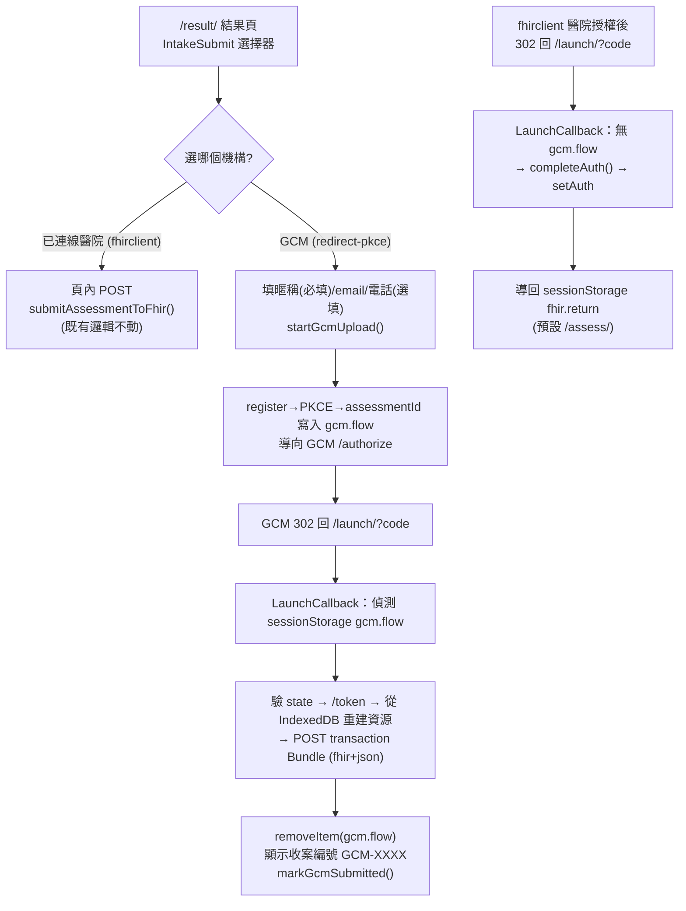

# GCM 收案上傳整合 — 設計

- **日期**：2026-05-31
- **狀態**：設計已核可，待寫實作計畫
- **背景**：患者於本機完成 CGA 評估後，可選擇把結果以標準 SMART on FHIR 上傳到外部收案點 `https://gcm.fhir.yao.care`。既有「已連線醫院 fhirclient」流程的頁內 POST 保留不動，GCM 為 redirect 型收案點。

## 目標與非目標

**目標**
- 在 `/result/` 結果頁提供統一的「收案機構」上傳入口。
- 新增 GCM redirect 型收案：動態註冊（RFC 7591）+ 授權碼 + PKCE/S256 → transaction Bundle 上傳。
- 新建共用 `/launch/` callback 頁，同時承接 GCM 回呼與既有 fhirclient standalone 回呼（此頁先前不存在，redirectUri 指向它卻會 404）。

**非目標**
- 不改既有 `submitAssessmentToFhir`（fhirclient 頁內 POST）的上傳邏輯。
- 不把收案 conformance 檢查納入 CI（避免依賴外部服務）。
- 不在本案處理 GCM 複診的進階 UI（僅以 `localStorage` 記錄收案編號供顯示）。

## 整合契約（GCM server 已上線且固定）

Base：`https://gcm.fhir.yao.care`

| 端點 | 用途 |
|---|---|
| `POST /register`（JSON） | RFC 7591 動態註冊 → `client_id`（public client，`token_endpoint_auth_method: none`） |
| `GET /authorize` | 授權碼 + PKCE/S256；以 `login_hint`(瀏覽器碼)+`nickname` 建立 patient context（兩者皆帶時直接 302 回 `code`） |
| `POST /token`（urlencoded） | 換 `access_token` + `patient`(=病例唯一碼 `GCM-XXXX`) + `refresh_token` |
| `POST /`（Bearer，transaction Bundle） | 上傳；server `$extract` 補 Patient、建立 Observation/DiagnosticReport |

**scope**（不得帶 `openid`/`fhirUser`，GCM 不支援 OIDC）：
```
launch/patient patient/Observation.c patient/DiagnosticReport.c patient/QuestionnaireResponse.c patient/Patient.u offline_access
```

**身分與行為要點**
- `aud` 必須等於 `https://gcm.fhir.yao.care`。
- patient context 由 server 以 `(瀏覽器唯一碼, 暱稱)` match-or-create；`login_hint`=瀏覽器碼、`nickname`=使用者輸入。
- `POST /token` 回的 `patient` = 病例唯一碼；同一 `(瀏覽器碼,暱稱)` 複診回同一個。
- transaction 內各資源 `subject` 由 server 強制設為 patient context，故 app 不必算對 subject。
- email/電話以 `QuestionnaireResponse` 帶上，server `$extract` 寫進 `Patient.telecom`。
- **`POST /` 必須用 `Content-Type: application/fhir+json`**（server 已新增此 parser；用 `application/json` 會回 415）。

## 現況落差（與原整合指引的差異）

1. **`/launch/` callback 頁不存在**。`src/lib/fhir/client.ts:25` 把 redirectUri 指向 `${origin}/launch/`，但 `src/pages/` 無此頁，且 `handleCallback()`/`completeAuth()` 從未被任何頁面呼叫——既有醫院 standalone 流程 redirect 回來後其實無人承接（先前 404）。本案新建此頁並一併把醫院回呼接起來。
2. **無「合作機構清單」資料結構**。僅有 `ServerConfig`（使用者手填、存 Dexie 的 FHIR server）。本案新增 typed 常數清單。
3. **`buildAssessmentObservations` 內部已 append CFS Observation**（`src/lib/fhir/cga-resources.ts:130`）。故 GCM payload **不得**再額外呼叫 `buildCfsObservation`，否則 CFS 重複（server 不在意數量、原樣保存，但語意上不應重複）。

## 整體架構

統一「收案機構」上傳模型，掛在 `/result/`。收案機構分兩種 `kind`：

- **`kind: 'fhirclient'`（已連線醫院）**：非靜態清單項，而是**執行期動態**項——僅 `authStore.isAuthenticated` 時出現，標籤用已連線 server 名稱。選取後走既有 `submitAssessmentToFhir`（頁內 POST，不 redirect）。
- **`kind: 'redirect-pkce'`（GCM）**：靜態 TS 常數清單項。選取後收集暱稱/email/電話 → `startGcmUpload` → redirect 至 GCM `/authorize`。



## 模組分解

| 模組 | 職責 |
|---|---|
| `src/lib/fhir/intake-institutions.ts` | 型別 `IntakeInstitution`（`kind: 'redirect-pkce'`、`id`/`name`/`base`/`intakeUrl`/`scopes`/`aud`）＋ GCM 常數（scopes 不含 `openid`/`fhirUser`，`aud=base`）。匯出 `REDIRECT_INSTITUTIONS: IntakeInstitution[]` |
| `src/lib/fhir/gcm-submit.ts` | `startGcmUpload(redirectUri, payload)` 與 `completeGcmUpload()`；含 `browserCode`/`b64url`/`makePkce`/`getClientId`（含自癒）/`intakeResponse` helper |
| `src/lib/db/schema.ts` | `Assessment` 新增 `gcmCaseId?: string` |
| `src/lib/db/assessments.ts` | 新增 `markGcmSubmitted(id, caseId)` |
| `src/pages/launch/index.astro` ＋ `src/components/fhir/LaunchCallback.svelte` | 共用 callback 頁：有 `gcm.flow`→完成 GCM 上傳並顯示收案編號；否則 `?code`→`completeAuth()`+setAuth→導回 return URL；皆無→中性提示/導回首頁 |
| `src/components/assess/IntakeSubmit.svelte` | 取代 `ResultView.svelte` 現有 result-actions 上傳區塊；統一選擇器（動態醫院項＋靜態 redirect 項），選 GCM 展開暱稱/email/電話表單 |
| `src/components/fhir/StandaloneLaunch.svelte`（小改） | redirect 前先存 `sessionStorage['fhir.return']`（= 目前路徑，預設 `/assess/`），讓 `/launch/` 能導回 |

### 介面契約

```ts
// intake-institutions.ts
export interface IntakeInstitution {
  id: string;            // 'gcm'
  kind: 'redirect-pkce';
  name: string;          // 'GCM 預防醫學發展協會'
  base: string;          // 'https://gcm.fhir.yao.care'
  intakeUrl: string;     // 'https://gcm.org.tw/fhir/Questionnaire/gcm-intake'
  scopes: string;        // 不含 openid/fhirUser
  aud: string;           // = base
}

// gcm-submit.ts
export interface PendingUpload {
  assessmentId: string;  // 只存 id，回呼後從 IndexedDB 重建
  nickname: string;      // 必填
  email?: string;
  phone?: string;
}
export function startGcmUpload(redirectUri: string, payload: PendingUpload): Promise<void>;
export function completeGcmUpload(): Promise<{ caseId: string; result: unknown }>;
```

## 資料流（GCM，跨 redirect）

`sessionStorage['gcm.flow']` 存：`{ verifier, state, redirectUri, clientId, payload: { assessmentId, nickname, email?, phone? } }`——**不存整包 FHIR 資源**。

`startGcmUpload`：
1. `getClientId(redirectUri)`（快取於 `localStorage['gcm.clientId']`；無則 `POST /register`，`redirect_uris:[redirectUri]`、`token_endpoint_auth_method:'none'`）。
2. `makePkce()` 產 verifier/challenge；產 `state`。
3. 寫 `sessionStorage['gcm.flow']`。
4. `location.assign(${base}/authorize?...)`，帶 `response_type=code`、`client_id`、`redirect_uri`、`scope`、`state`、`aud=base`、`code_challenge`、`code_challenge_method=S256`、`login_hint=browserCode()`、`nickname`。

`completeGcmUpload`（於 `/launch/`）：
1. 讀 `gcm.flow`；驗 `params.state === flow.state`（不符→CSRF 中止）；無 `code`→顯示 `error`。
2. `POST /token`（urlencoded：`grant_type=authorization_code`、`code`、`redirect_uri`、`code_verifier`、`client_id`）→ `access_token` + `patient`(=收案編號)。
3. `getAssessment(payload.assessmentId)` + `getChild(assessment.childId)`。
4. `buildAssessmentObservations(assessment, child.id, assessment.triageResult as TriageResult)` ＋ `buildTriageDiagnosticReport(...)`——**不另呼叫 `buildCfsObservation`**。
5. 若 `email`/`phone` 存在，組 intake `QuestionnaireResponse`（linkId 對齊 server，見下）。
6. 組 transaction Bundle（entry：QuestionnaireResponse?, observations..., diagnosticReport），`POST /`，header `Content-Type: application/fhir+json` + `Authorization: Bearer`。
7. **成功後 `sessionStorage.removeItem('gcm.flow')`**、`markGcmSubmitted(assessmentId, caseId)`、`localStorage['gcm.case.<browserCode>.<nickname>'] = caseId`。
8. 回傳 `{ caseId, result }`，UI 顯示收案編號。

### intake QuestionnaireResponse linkId（須對齊 server 初診表單）

`$extract` 靠這些 linkId 寫進 `Patient.telecom`：
- email：`email` → 子項 `email-system`(valueString `'email'`)、`email-value`(valueString email)
- phone：`phone` → 子項 `phone-system`(valueString `'phone'`)、`phone-value`(valueString phone)
- `questionnaire` = `intakeUrl`，`status: 'completed'`

## 共用 `/launch/` 分流

`LaunchCallback.svelte`（`client:load`），onMount 依序判定：
1. **`sessionStorage['gcm.flow']` 存在** → `completeGcmUpload()`：成功顯示收案編號 + 「返回結果頁」；失敗顯示訊息 + 重試/返回。
2. **否則 URL 有 `code`/`state`/`error`** → fhirclient 回呼：`handleCallback()`（`completeAuth()`）→ `authStore.setAuth(...)` → 導回 `sessionStorage['fhir.return'] ?? '/assess/'`（並清除該鍵）。
3. **皆無** → 中性提示並導回首頁。

> **關鍵**：步驟 1 的 `gcm.flow` 必在成功後清除。`/launch/` 以「有無 `gcm.flow`」分流；若不清，下次醫院授權回 `/launch/` 會被誤判為 GCM 完成流程。

## redirect_uri 一致性（server 精確比對）

`redirect_uri` 三處必須**逐字一致（含結尾斜線）**：`/register` 登記、`/authorize` 帶、`/token` 帶，皆為 `${location.origin}/launch/`。astro `base='/'`，故 `/launch/` 正確；沿用既有 `client.ts` 慣例。

## client_id 自癒

`/authorize` 或 `/token` 回 `invalid_client`（server 端資料曾重置時）→ 清 `localStorage['gcm.clientId']`，重新 `POST /register` 取新 `client_id` 後重試一次。`getClientId` 與 token 流程需支援此重試路徑。

## 錯誤處理

- 舊紀錄無 `triageResult.details`（型別 optional）→ 在 `IntakeSubmit` 擋下，不給上傳（提示「結果資料不完整，無法上傳」）。
- `state` 不符 → 中止（CSRF）；URL `?error=` → 顯示授權失敗訊息。
- `/register`、`/token`、`POST /` 非 2xx → 顯示訊息 + 「返回結果頁」可重試；`invalid_client` 走自癒。
- 離線 → 提示需網路連線（GCM 上傳本質需網路）。
- **PII 紀律**：暱稱/email/電話一律不進 `console`（專案規則）。

## 安全與專案規則對齊

- 無硬編碼密鑰；`client_id` 動態註冊（public client）。
- `console` 不輸出 PII；PDF 報告不受影響（仍僅用 FHIR Patient ID）。
- CSS/型別/Svelte 5 runes 等既有規則照常套用於新元件。
- 不使用大陸廠牌 AI 服務（N/A）。

## 測試策略

vitest 單元：
- `b64url`、`makePkce`（驗 challenge = base64url(SHA-256(verifier))）等純函式。
- `getClientId`：快取命中不重打 `/register`；`invalid_client` 自癒會清快取並重註冊。
- `completeGcmUpload`（mock `fetch` + `crypto.subtle` + Dexie）：
  - Bundle entry 組成正確（QuestionnaireResponse 僅在有 email/phone 時、observations、diagnosticReport）。
  - **不重複 CFS**（observations 內 CFS 僅一筆）。
  - 舊紀錄無 `triageResult.details` → 擋下。
  - `state` 不符 → 拋錯。
  - 成功後 `gcm.flow` 已清除、`markGcmSubmitted` 被呼叫。
  - **`POST /` 使用 `application/fhir+json`，server 回 200 transaction-response**（mock 驗 header 與回應型別）。
- `intake-institutions`：GCM 常數的 scopes 不含 `openid`/`fhirUser`、`aud === base`。

既有 `cga-resources` builder 不改，沿用其現有測試。

線上 conformance（不進 CI，手動）：完成後對 `https://gcm.fhir.yao.care` 以整合指引 §6 的 curl 驗證端到端（`POST /register`、`GET /Questionnaire?url=...`）；若 GCM repo 的 `scripts/conformance-check.mjs` 可取得，亦可跑完整 PKCE→token→transaction 流程。

## 產生檔 / CI 影響

- 不動內容/量表，無 video-index / clinical-education / expected-questionnaire-domains 產生檔 drift。
- `schema.ts` 新增 optional 欄位為相容變更（舊紀錄缺欄）。
